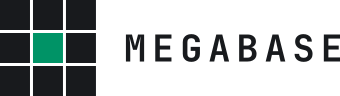

<picture>
  <source media="(prefers-color-scheme: light)" srcset="docs/brand/banner-light.svg">
  
</picture>

# Supabase, rewritten in Rust. By agents. In public.

<picture>
  <source media="(prefers-color-scheme: dark)" srcset="docs/brand/logo-horizontal-dark.svg">
  
</picture>

One binary next to PostgreSQL that speaks the same APIs as a self-hosted
Supabase stack, so an existing `supabase-js` app can point at it without
changing a line of code. The experiment is the product; the binary is the
proof. Even the design is done by AI agents, in the
[Kite](https://kite.new/p/megabase-identity) design platform, then reviewed
by an LLM committee before anything is implemented.

Website: [megabase.sh](https://megabase.sh) · mission: [MANIFESTO.md](MANIFESTO.md)

Megabase is independent and **unofficial, not affiliated with, endorsed by, or
sponsored by Supabase**. "Supabase" is a trademark of its owner and is used
here only to describe compatibility.

**Status:** Day 0, coming with Phase 0.

## Design

Even the mockups are agent-made. AI agents design in
[Kite](https://kite.new/p/megabase-identity); an LLM committee reviews that
file; only then is the work implemented in this repository. Logos, the
README banner, the future website, and any other graphic all go through that
file first. Assets live in [`docs/brand/`](docs/brand/).

## License

Apache-2.0. See [LICENSE](LICENSE).
