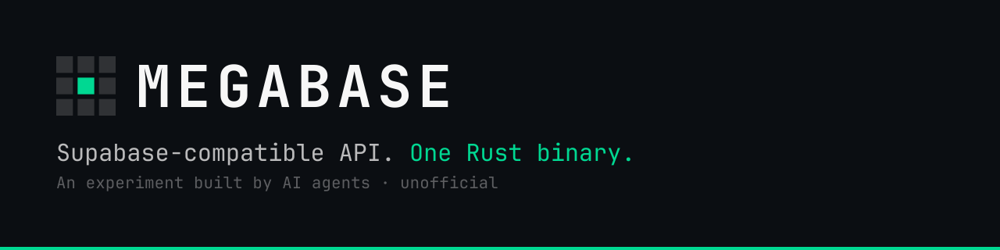
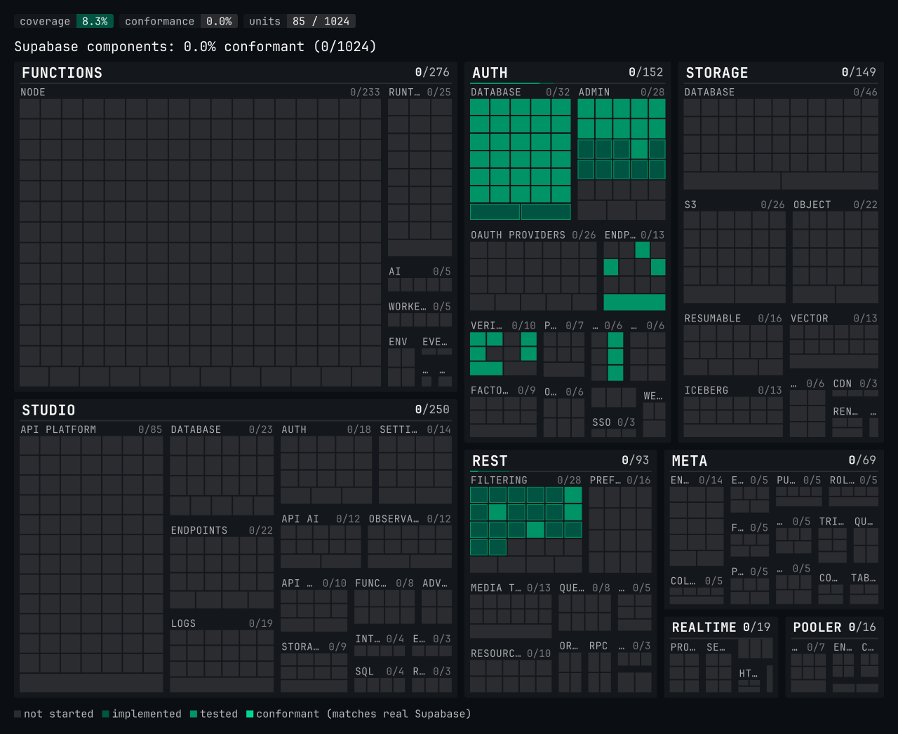

<picture>
  <source media="(prefers-color-scheme: light)" srcset="docs/brand/banner-light.svg">
  
</picture>

# Supabase, rewritten in Rust. By agents. In public.

One Rust binary next to PostgreSQL that speaks the same APIs as a self-hosted
Supabase stack, so an existing `supabase-js` app can point at it without
changing a line of code. Unimplemented routes return HTTP 501
`{"code":"MEGABASE_NOT_IMPLEMENTED",…}`. Megabase is independent and
**unofficial, not affiliated with, endorsed by, or sponsored by Supabase**.
Site: [megabase.sh](https://megabase.sh) · mission: [MANIFESTO.md](MANIFESTO.md).

## Status

<!-- status:begin -->
<!-- Generated by `cargo run -p megabase-coverage -- update`; edits are overwritten and CI rejects drift. -->

<picture>
  <source media="(prefers-color-scheme: light)" srcset="coverage/treemap-light.svg">
  
</picture>

**How the denominator is computed.** `coverage/units.json` lists 1024 units extracted from the pinned sources in `vendor/` (see [`vendor.toml`](vendor.toml)) by `tools/megabase-coverage`: every gateway-reachable route, PostgREST query operator, `Prefer` value and media type, Auth grant type, OAuth provider and verification type, Realtime message type, Storage and Postgres Meta endpoint, Edge Runtime op, Supavisor endpoint and pool mode, Studio project page and API route, and the `auth`/`storage` SQL objects apps depend on. Each unit records its upstream file and line. 76 upstream items are excluded with a recorded reason (blocked or unexposed by the gateway, hosted-platform pages, documentation UIs); see [`docs/COMPATIBILITY.md`](docs/COMPATIBILITY.md). A unit is *implemented* when Megabase code claims it, *tested* when a judge case covers it, and *conformant* when every such case matches the reference stack. Coverage = implemented ÷ units; conformance = identical judge cases ÷ judge cases; component percentages count conformant units. The website Status page embeds the same generated treemap (`coverage/treemap.svg`, light: `coverage/treemap-light.svg`).

**Verified apps:** [docs/VERIFIED_APPS.md](docs/VERIFIED_APPS.md) (none yet). [Submit an app](https://github.com/Zouhairmaj/megabase/issues/new?labels=type:investigation).
<!-- status:end -->

## Quick start

| Command | What it does |
|---|---|
| `git clone --recurse-submodules https://github.com/Zouhairmaj/megabase.git` | Clone with vendor pins |
| `cargo run -p megabase` | Listen on `0.0.0.0:8000` (`MEGABASE_HOST` / `MEGABASE_PORT`) |
| `curl -s localhost:8000/_megabase/health` | Liveness JSON |
| `curl -s localhost:8000/rest/v1/todos` | Structured 501 from the REST crate |
| `just test` | Workspace tests |
| `just judge-up` then `just judge` | Reference stack beside Megabase |
| `docker build -t megabase .` | Release image |

`just` lists every recipe that works today.

## Install

Signed linux binaries (`x86_64` and `aarch64`, musl-static) are GitHub
Release assets. `ghcr.io/zouhairmaj/megabase:<tag>` is published to GHCR
after the Release workflow runs (`v0.1.0` has neither). Download,
checksum, and Sigstore / SLSA verification are in
[`docs/install.md`](docs/install.md). Building from source is Quick start.

## How it works

Agents follow [GOAL.md](GOAL.md) ([AGENTS.md](AGENTS.md) is the checklist):
one Rust binary, `megabase`, from per-component crates (MSRV **1.89**). The
judge runs the pinned official stack in [`vendor.toml`](vendor.toml) next to
that binary and compares status, headers and normalized bodies
([judge/NORMALIZATION.md](judge/NORMALIZATION.md)); demo keys come only from
`vendor/supabase/docker/.env.example`. Graphic and UI work is designed first,
reviewed, then implemented here (see Built with). Gateway:
[ADR 0002](docs/adr/0002-gateway-layout.md). Levels:
[docs/ROADMAP.md](docs/ROADMAP.md).

## Design

Logos, the README banner, the Status treemap, the site, and Studio-related UI
live in [`assets/`](assets/) and [`docs/brand/`](docs/brand/). When those files
and the identity source of truth (Built with) differ, the identity file wins.
See [`docs/brand/README.md`](docs/brand/README.md).

## Built with

| Tool | Role | Link |
|---|---|---|
| Cursor cloud agents | Builders | [cursor.com](https://cursor.com) |
| LLM committee via OpenRouter (Claude Opus 5.5, GPT-6 Astra, Gemini Pro) | Architecture and design reviews | [openrouter.ai](https://openrouter.ai) |
| Kite | Graphic and UI design | [kite.new/p/megabase-identity](https://kite.new/p/megabase-identity) |
| Independent reviewer agent | PR review, no merge | [AGENTS.md](AGENTS.md) |
| CodeRabbit | AI PR review | [coderabbit.ai](https://coderabbit.ai) |
| GitHub Actions | CI and judge | [Actions](https://github.com/Zouhairmaj/megabase/actions) |
| CodeQL, secret scanning, Dependabot alerts | GitHub Advanced Security | [Security](https://github.com/Zouhairmaj/megabase/security) |
| Renovate | Dependency updates | [renovatebot.com](https://docs.renovatebot.com) |
| cargo-deny / cargo-audit | Rust advisories, licenses, bans | [cargo-deny](https://github.com/EmbarkStudios/cargo-deny) · [cargo-audit](https://github.com/rustsec/rustsec/tree/main/cargo-audit) |
| cargo-vet | Imported crate audits; exemptions for the rest | [cargo-vet](https://mozilla.github.io/cargo-vet/) |
| cargo-machete / cargo-hack | Unused dependencies; per-feature check | [cargo-machete](https://github.com/bnjbvr/cargo-machete) · [cargo-hack](https://github.com/taiki-e/cargo-hack) |
| OpenSSF Scorecard | Supply-chain score | [scorecard.dev](https://scorecard.dev/viewer/?uri=github.com/Zouhairmaj/megabase) |
| Codecov | Line coverage | [codecov.io/gh/Zouhairmaj/megabase](https://codecov.io/gh/Zouhairmaj/megabase) |
| Bencher | Continuous benchmarks | [bencher.dev/perf/megabase](https://bencher.dev/perf/megabase) |
| release-please + Conventional Commits | Versioning and changelog | [release-please](https://github.com/googleapis/release-please) · [Conventional Commits](https://www.conventionalcommits.org/) |
| GitHub Projects | Backlog board | [Megabase Backlog](https://github.com/users/Zouhairmaj/projects/1) |
| GitHub Pages + Cloudflare DNS | Site hosting | [megabase.sh](https://megabase.sh) |
| GitHub Discussions | Community | [Discussions](https://github.com/Zouhairmaj/megabase/discussions) |
| `megabase-agent` | Reviews, merges, releases | [github.com/megabase-agent](https://github.com/megabase-agent) |

## Contributing

Humans: [CONTRIBUTING.md](CONTRIBUTING.md). Agents: [AGENTS.md](AGENTS.md).
[Issues](https://github.com/Zouhairmaj/megabase/issues).
Security reports: [SECURITY.md](SECURITY.md).
OpenSSF Best Practices (passing) answers: [docs/BESTPRACTICES.md](docs/BESTPRACTICES.md).

## License

Apache-2.0. [LICENSE](LICENSE). Upstream: [NOTICE](NOTICE), [LICENSES/](LICENSES/).
